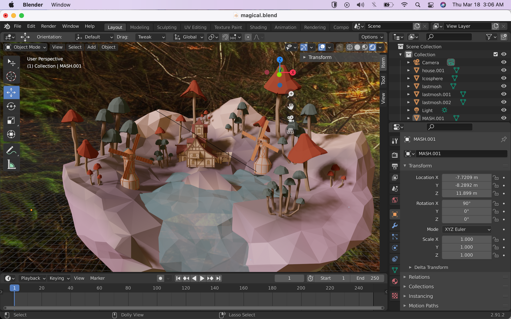
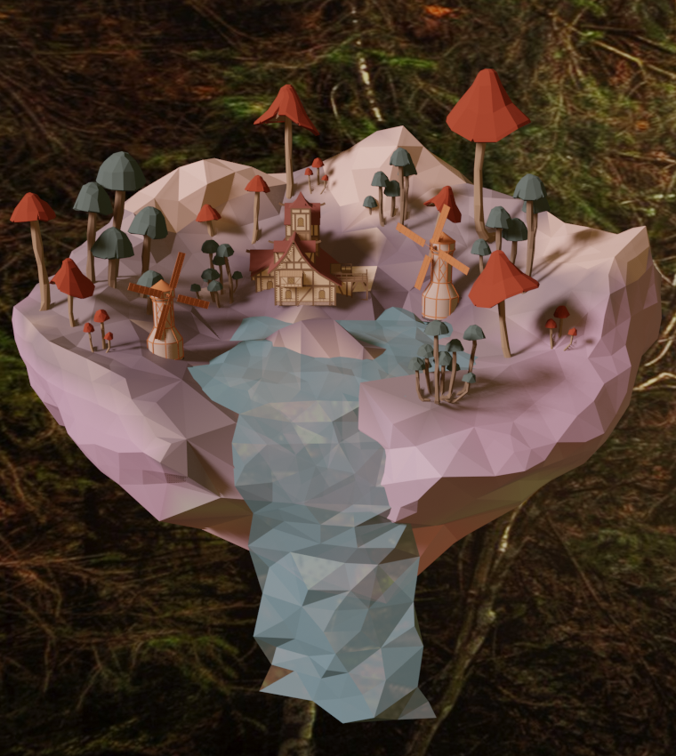

# Entry 3
##### 3/18/2021

---

While exploring [three.js](https://threejs.org) once more, I found a great way to express my love for 3D modeling and creativeness. 
Today, I tested the importation of models from external sites like [Blender](https://www.blender.org/), which I am very familiar with.
I'm using both CS50IDE, Blender, and Github to tinker since they go hand in hand. The main focus of today's work was loaders for models and more specifically, the GLTF loader.

---

With the help of Mr. Mueller after much frustration, we found out how to get it working by using [this video](https://youtu.be/F4q2cqj_Tdc).
Initially, I imported a model from a past project I did, but I realized I could do way better.
As of now, I am currently in step 5 of the Engineering Design Process where I created a prototype. 
The general terraforming was made with meshes with an intention of low poly graphics that I mention in Blog Entry 1. The models like mushrooms, windmills, and the house that were used were taken from a site that offers them for free.
Keeping in note that my Freedom Project is mainly on an entertainment space, I thought of what would be the most appealing.
I tend to have an aesthetic that is pastel, magical, yet simplistic with great detail. 
After having a general idea, I started putting it into practice with the help of [this video](https://www.youtube.com/watch?time_continue=151&v=0lj643VmTsg&feature=emb_title.).
It taught me a lot of the concepts behind materials and just overall shaping when it comes to floating islands. 

---

The documentation on the three.js site helped me so much in getting this done. The examples and documents I referenced for this project was:
<ul>
<li>https://threejs.org/docs/?q=l#examples/en/loaders/GLTFLoader</li>
<li>https://threejs.org/docs/?q=light#api/en/lights/shadows/SpotLightShadow</li>
<li>https://threejs.org/docs/?q=light#api/en/lights/SpotLight</li>
<li>https://threejs.org/examples/#webgl_lights_spotlight</li>
</ul>

The reason why these 4 sites were very important was because I was trying to relpicate what I saw in Blender:




I wanted that same effect, but realized three.js does not work the same way. Either way, it still looked very good so I was satisfied.

---

DEFINITIONS AND RELEVANCE
<ul>
<li>GLTF - file format for 3D scenes and models with the JSON format</li>
Relevance: I picked this format in comparison to the other twelve loaders after researching that it is more compatible with programs I'm using or hoping to use.
<li>Orbit Controls - allow the camera to orbit around a target.</li>
Relevance: It made sense to pick this type of control to allow both user interaction or more immersion into the scene. 
<li>Spot Light - emission from a single point in one direction, along a cone that increases in size the further from the light it gets.</li>
```
 var spotLight = new THREE.SpotLight("#FFC19E") 
 spotLight.position.set( 0.4982 , 70.32728 , 90.7961  );
 spotLight.power = 5;
 spotLight.angle = Math.PI / 1;
 spotLight.decay = -5;
 spotLight.distance = .2;
 spotLight.castShadow = true;
```
Relevance: I needed a source of light and decided spot light was the best simply because it allowed shadows which creates depth in the project.
</ul>

---

In the beginning, my biggest problem was simply getting the loader to load my GLTF model. After figuring it out with Mr. Mueller, I continued to make it presentable with setting up the scene.
It took me hours to figure out the perfect positioning of not only the camera, but also the controls for their limitations. Because the format runs on [Vector 3](https://threejs.org/docs/?q=light#api/en/math/Vector3), it was hard to visually plan in my head how the x,y,z plane would go.
Moving forward, I want to add on the current prototype or take that general basis and expand it to where I could complete it with full detail. Since my class will be learning DOM soon, I want to incorporate HTML and CSS into giving them an alert that it was made by me and the whole purpose of this project.

---

FINAL SKILLS

Within the span of coding today, I've worked on skills on <b>how to read, debug, pay attention to detail, and be creative.</b>
Being on your own, there are so many decisions you have to make in order to bring something together. I read alot of documentation in order to formulate my own thoughts. These fundametals included in the docs were necessary for me to understand the formatting so I reduce my errors.
Of course, there were errors though. Usually, CS50IDE would show a red dot next to a line if something is wrong, but the fact that three.js is a tool, it doesn't do that.
I had to make sure all the positioning, limitations, and even the model were showing up correctly on the users end. This meant alot of serving, testing, refreshing, and other tiny rearrangments.
Stack Overflow was especially great at answering any questions on coding. Going hand in hand, my attention to detail and creativeness was shown in my model as well as code.
I thought of other ways because I didn't want to just work with the limited geometry three.js offered. I made my own geometry which turned out really well!
Knowing that I want to pursue a career in this field, this project has helped me along the way in the wy I think as well as improving on my hard and soft skills.

---

[Previous](entry02.md) | [Next](entry04.md)

[Home](../README.md)