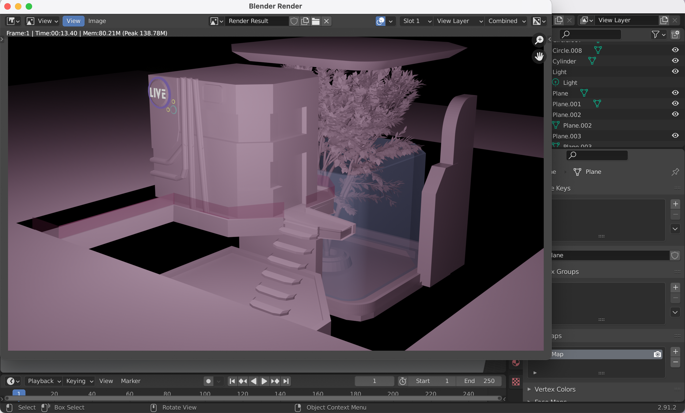
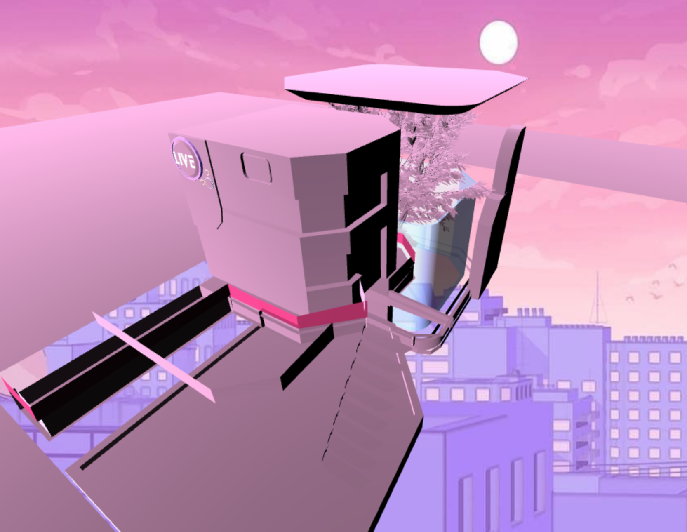

# Entry 4
##### 5/27/2021

---
<b>GENERAL INFORMATION</b>

For the past weeks, I've been working on 3D models in [Blender](https://www.blender.org/) after the last project turned out to be successful in importing with the [GLTF Loader](https://threejs.org/docs/#examples/en/loaders/GLTFLoader). I tinkered with the ieas of alternate realities, straying a bit away from the original plan. I made today's model off of a lavender themed cyberpunk and nature combination which you can see in the pictures later on.. The reason why I did this was because I found that I was more passionate about this project than the original plan of a model for a city. It strays away from the low-poly because I felt like it wouldn't look good and it makes each piece of work different. The main focus of today was to build and import it in while adjusting a new HTML file to adjust the new scene. 

---
<b>CHALLENGES</b>

One of the common problems that I had was building the model in general. Each model takes me about 18-22 hours to make so it took me a while to finish this on top of the stress I had from other classes and exams. I had to watch plenty of videos because I learned new toold in Blender like splicing and reshaping using vertices or edges. I took inspiration and a lot of new techniques from a [cyberpunk London tutorial](https://www.youtube.com/watch?v=30batut62n0&t=23s) which really helped me discover the types of builds I like. As of now, I am currently in step 7 of the Engineering Design Process where I'm improving in certain areas of both the last and current model. I make tweaks here and there when I see something I don't like that I didn't expect because everything else is finished. 

---
<b>EXPANSION</b>

After exporting the model from Blender and importing it into three.js using the GLTF Loader, I started to adjust previous settings for the light and background to compliment it. I found a great documentation on [skyboxes and image backgrounds](https://threejsfundamentals.org/threejs/lessons/threejs-backgrounds.html) (Some stack overflow helped as well). After trying with several different images, I was so proud it worked because it looked really good that the model was highlighted in comparison to the background. Next, I adjusted the lighting so it shows up brighter because I would expect a cyberpunk build to illuminate with all the neon lights. In the end, here are my results: 



NOTE: Sadly, some things from Blender's model didn't transfer over so I definitely will fix this the next time I work on the project! Instead, you'll see something like this:



---

I felt as if some part of the project was missing to make it an actual virtual experience for entertainment. I finally realized it was music! Using a post from Stack Overflow that asked about [inputting music](https://stackoverflow.com/questions/9419263/how-to-play-audio), I was able to create an even better aesthetic. I didn't use three.js for this, but instead I used simple javascript with help from learning functions in class. I recorded the music using QuickTime Player and a Youtube video. I then converted the .aitf file into a mp3 file in order to play it. I was so extremely happy because it only added to the fantasies and dreams I wanted to portray.

---

<b>DEFINITIONS AND RELEVANCE</b>

<ul>
<li><b>Cyberpunk </b>- A genre of science fiction set in a subculture  dominated by computer technology.</li>
<li><b>Aitf & mp3 files</b> - different types of file that holds music or audio in it </li>
Relevance: Basis and need to add to the aesthetic of the new 3D model
</ul>

---
<b>EXAMPLE OF MUSIC: </b>
```
<script>
    function playMusic(){
       music.play();
    }   
    playMusic();
</script>

<!-- HTML -->
<audio id="music" loop src="cyberMusic.mp3" autoplay> </audio>
```
---

<b>FINAL SKILLS</b>

Within the span of coding and building through the past month, I've worked on skills on debugging, how to google, creativity, and embracing failure. I've been working on this project alone meaning there really isn't someone to hold me accountable. Time after time, I would get caught up in the little mistakes which would really hurt me because I am a perfectionist. Working on taking away that thought of perfection, I realized it'll only bring me stress. I talked to a teacher I'm well acquainted with and she gave me the motivation to start again, embracing my failure in both my code and in life. I started to read alot of documentation on both Blender AND Three.js. I started to go past just the fundamentals and feel as if I've been going above and beyond. Of course, once in a while errors would pop up. If I couldn't solve them then and there, I came back the next day with a fresh mind to debug. I would tinker with positioning and certain numbers to see what would fit the best for my project. It was especially tough because three.js is a tool, meaning it can't be autocorrected in CS50 IDE. I had to make sure the audio popped up as soon as the window loaded and create that atmosphere of being immersed in a world. This meant a whole lot of testing and refreshing. Stack Overflow and Youtube videos turn out to be my best friend in this whole process. Before even watching a video, I learned how to google by seeing if a video is too long, if documentation was outdated, and if the difficulty level was right for me. My creativeness was heavily shown in not only the build but also thinking about what goes into the immersion of the alternate reality. Knowing that I definitely want to pursue a career in technology (mostly graphic design, 3D modeling, or computer science), this project has definitely led me to explore my passions even further.

---


[Previous](entry03.md) | [Next](entry05.md)

[Home](../README.md)