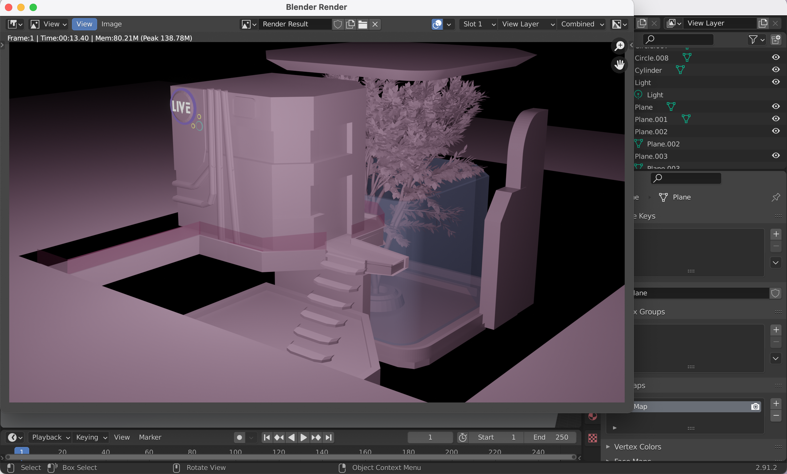

# Entry 4
##### 5/27/2021

---

For the past weeks, I've been working on 3D models in [Blender](https://www.blender.org/) after the last project turned out to be successful in importing with the [GLTF Loader](https://threejs.org/docs/#examples/en/loaders/GLTFLoader). I tinkered with the ieas of alternate realities, straying a bit away from the original plan. I made today's model off of a lavender themed cyberpunk and nature combination which you can see in the pictures later on.. The reason why I did this was because I found that I was more passionate about this project than the original plan of a model for a city. It strays away from the low-poly because I felt like it wouldn't look good and it makes each piece of work different. The main focus of today was to build and import it in while adjusting a new HTML file to adjust the new scene. 

---

One of the common problems that I had was building the model in general. Each model takes me about 18-22 hours to make so it took me a while to finish this on top of the stress I had from other classes and exams. I had to watch plenty of videos because I learned new toold in Blender like splicing and reshaping using vertices or edges. I took inspiration and a lot of new techniques from a [cyberpunk London tutorial](https://www.youtube.com/watch?v=30batut62n0&t=23s) which really helped me discover the types of builds I like. As of now, I am currently in step 7 of the Engineering Design Process where I'm improving in certain areas of both the last and current model. I make tweaks here and there when I see something I don't like that I didn't expect because everything else is finished. 

---

After exporting the model from Blender and importing it into three.js using the GLTF Loader, I started to adjust previous settings for the light and background to compliment it. I found a great documentation on [skyboxes and image backgrounds](https://threejsfundamentals.org/threejs/lessons/threejs-backgrounds.html) (Some stack overflow helped as well). After trying with several different images, I was so proud it worked because it looked really good that the model was highlighted in comparison to the background. Next, I adjusted the lighting so it shows up brighter because I would expect a cyberpunk build to illuminate with all the neon lights. In the end, here are my results: 



---

I felt as if some part of the project was missing to make it an actual virtual experience for entertainment. I finally realized it was music! Using a post from Stack Overflow that asked about [inputting music](https://stackoverflow.com/questions/9419263/how-to-play-audio), I was able to create an even better aesthetic. I didn't use three.js for this, but instead I used simple javascript with help from learning functions in class. I recorded the music using QuickTime Player and a Youtube video. I then converted the .aitf file into a mp3 file in order to play it. I was so extremely happy because it only added to the fantasies and dreams I wanted to portray.

---

DEFINITIONS AND RELEVANCE

<ul>
<li>Cyberpunk - A genre of science fiction set in a subculture  dominated by computer technology.</li>
<li>Aitf & mp3 files - different types of file that holds music or audio in it </li>
Relevance: Basis and need to add to the aesthetic of the new 3D model
</ul>

---
Example of Music:
```
<script>
    function playMusic(){
       music.play();
    }   
    playMusic();
</script>

<!-- HTML -->
<audio id="music" loop src="cyberMusic.mp3" autoplay> </audio>
```
---

[Previous](entry03.md) | [Next](entry05.md)

[Home](../README.md)